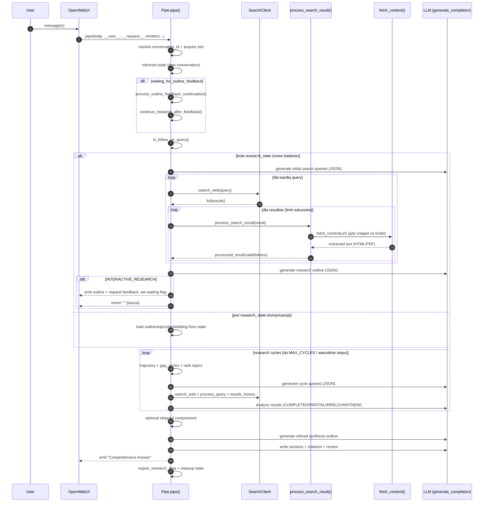

# Algorytm Pipe „Deep Research at Home”

Ten dokument opisuje przepływ wykonania Pipe w runtime OpenWebUI: od wejściowego message, przez cykle badawcze, aż do syntezy raportu z cytowaniami.

## Cel funkcjonalny

Pipe ma dostarczać „research report” składający się z:
- outline badań (opcjonalnie z interaktywną korektą użytkownika),
- iteracyjnego zbierania wyników (search → fetch → ekstrakcja → filtrowanie),
- utrzymywania stanu postępu i priorytetyzacji kolejnych cykli,
- syntezy finalnego raportu (sekcje, cytowania, bibliografia, review),
- eksportu danych badań.

## Architektura wykonania (moduły)

Klasa `Pipe` jest składana z miksinów w `src/pipe_impl.py`. Najważniejszy „kręgosłup” to:
- `PipeEntryMixin.pipe(...)` w `src/pipe_entry.py` – steruje całością,
- `SearchClient.search_web(...)` w `src/search.py` – wyszukiwanie,
- `PipeSearchingMixin.process_search_result(...)` w `src/pipe_searching.py` – przetworzenie pojedynczego wyniku,
- `PipeFetchingMixin._fetch_content_impl(...)` w `src/pipe_fetching.py` – fetch HTML/PDF i cache URL,
- `PipeSemanticsMixin.get_embedding(...)` w `src/pipe_semantics.py` – embeddingi + cache,
- `PipeInteractiveMixin.rank_topics_by_research_priority(...)` w `src/pipe_interactive.py` – priorytety tematów,
- `PipeSynthesisMixin.*` i `PipeCitationsMixin.*` – finalna synteza i cytowania.

## Diagram sekwencji (wysoki poziom)



## Pseudokod (rdzeń `pipe(...)`)

Pseudokod jest celowo zbliżony do struktury w `src/pipe_entry.py`, żeby łatwo mapować fragmenty na implementację.

```text
pipe(body, __user__, __request__, emitters...):
  bind emitters/user/request
  messages = body.messages; if empty: return ""

  conversation_id = resolve from body + user_id
  set conversation context
  acquire conversation slot (limit równoległości)
  ensure per-conversation executor

  if new conversation AND not waiting_for_outline_feedback:
    reset_state(conversation_id)

  ensure tracking maps + memory_stats
  if not ENABLED or task != default: return ""
  user_message = last message content

  if waiting_for_outline_feedback:
    feedback = process_outline_feedback_continuation(user_message)
    (outline, all_topics, outline_embedding) = continue_research_after_feedback(...)
    initialize_research_state(original_query, outline, all_topics, outline_embedding)

  is_follow_up = is_follow_up_query(messages)
  summary_embedding = embedding(prev_comprehensive_summary) if follow_up else None

  if state.research_state exists:
    load outline/all_topics/outline_embedding/user_message from state
    initial_results = []
  else:
    initial_queries = LLM.generate_queries(user_message[, prev_summary])
    initial_results = for q in initial_queries: process_query(q, ...)
    outline = LLM.generate_outline(user_message, initial_results)
    all_topics = flatten(outline)
    outline_embedding = embedding(" ".join(all_topics))
    initialize_research_dimensions(all_topics, user_message)

    if INTERACTIVE_RESEARCH:
      emit outline + set waiting flag + return "" (pauza do następnego message)
    else:
      initialize_research_state(user_message, outline, all_topics, outline_embedding, initial_results)

  cycle = 1
  while cycle < MAX_CYCLES and active_outline not empty:
    cycle += 1
    if cycle > 2: research_trajectory = calculate_research_trajectory(...)
    gap_vector = calculate_gap_vector()
    prioritized_topics = rank_topics_by_research_priority(active_outline, gap_vector, completed_topics, results_history)
    cycle_queries = LLM.generate_cycle_queries(context + prioritized_topics + summaries + prefs)

    cycle_results = for q in cycle_queries: process_query(q, ...)
    analysis = LLM.analyze_and_update_outline(active_outline, cycle_results, summaries, completed, irrelevant)
    update completed/irrelevant/new topics + cycle_summaries + dimension coverage
    stop if: no topics OR (cycle>=MIN_CYCLES and completion>0.7) OR (cycle>=MAX_CYCLES)

  if STEPPED_SYNTHESIS_COMPRESSION: results_history = apply_stepped_compression(results_history)
  synthesis_outline = generate_synthesis_outline(outline, completed_topics, user_message, results_history)
  sections = generate per-subtopic content + citations + verify citations
  bibliography = generate_bibliography(global_citation_map, sections)
  titles/abstract/introduction/conclusion + review_edits
  link citations [n] -> [^n], append bibliography, mark research_completed
  emit final answer + export + cleanup
```

## Kluczowe decyzje algorytmiczne (dlaczego tak)

- **Stan per-konwersacja**: pozwala izolować równoległe chaty i robić follow-up w ramach tej samej rozmowy (zob. `docs/pipe/STATE.md`).
- **INTERACTIVE_RESEARCH**: pipe może się „zatrzymać” po wygenerowaniu outline i poczekać na feedback użytkownika (slash-komendy lub naturalny język).
- **Iteracyjne cykle**: w każdym cyklu pipe zmienia priorytety tematów (trajectory/gap/PDV), generuje kolejne query i aktualizuje listę tematów (COMPLETED/IRRELEVANT/NEW).
- **Kompresja**: ogranicza rozmiar kontekstu do syntezy i stabilizuje jakość w długich sesjach.
- **Cytowania**: wszystkie cytowania w tekście są normalizowane do `[n]`, a finalnie linkowane do przypisów `[^n]` w bibliografii.

## „Miejsca do modyfikacji” (hot spots)

- Flow całości (kolejność kroków, warunki stopu): `src/pipe_entry.py`
- Interaktywny feedback (komendy `/keep`, `/remove`, PDV): `src/pipe_interactive.py`
- Wyszukiwanie (źródło wyników, fallback, parsowanie): `src/search.py`
- Fetch/antyblokady/cache URL: `src/pipe_fetching.py` + `src/content.py`
- Token-limity i obsługa powtórek URL: `src/pipe_searching.py`
- Priorytety tematów / trajectory / gap: `src/pipe_interactive.py` + `src/pipe_semantics.py`
- Synteza raportu: `src/pipe_synthesis.py`
- Cytowania i weryfikacja: `src/pipe_citations.py`

